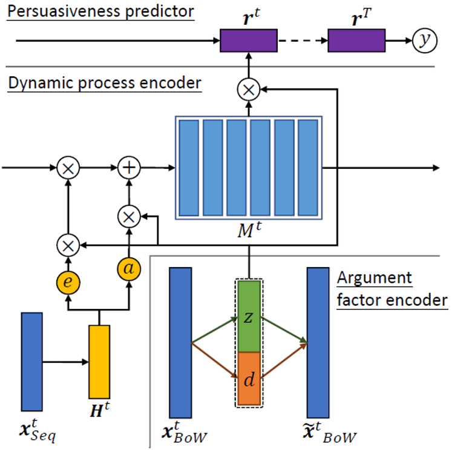

# DTDMN
Dynamic Dynamic Topic-Discourse Memory Networks (DTDMN) dynamically
tracks the changes of latent topics and discourse in argumentative
conversations, allowing the investigation of their roles
in influencing the outcomes of persuasion for argumentation mining. 

<p align="center"></p>

More details can be referred to:
> What Changed Your Mind: The Roles of Dynamic Topics and
Discourse in Argumentation Process. WebConf 2020.

# Data
CMV and Court dataset are in `data/`, with the preprocessing script `process_json.py`. You need to download the CMV dataset from [here](https://chenhaot.com/data/cmv/cmv.tar.bz2).

# Usage
You can run the main code as:
```angular2html
$ python dtdmn_run.py
```